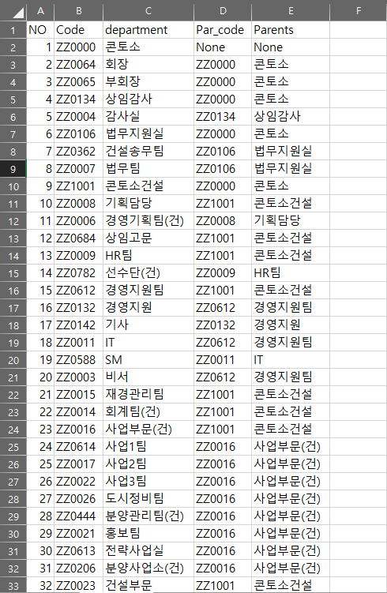
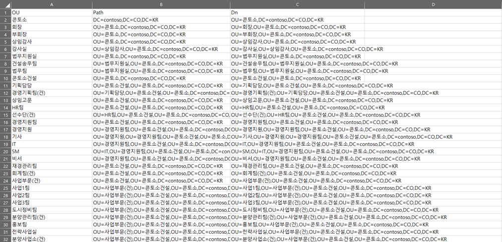

# contoso_ou.ps1(https://github.com/scho89/PowerShell/blob/master/ActiveDirectory/contoso_OU.ps1)   
Creating OU from department list.   
Use "code" column as an unique key for entry.   

Source:   
   

Result:   

