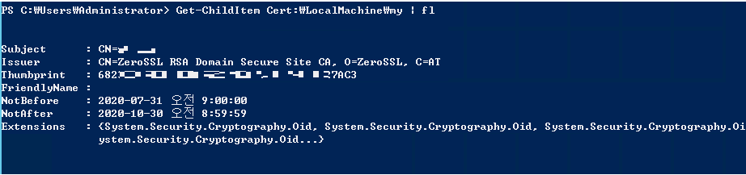
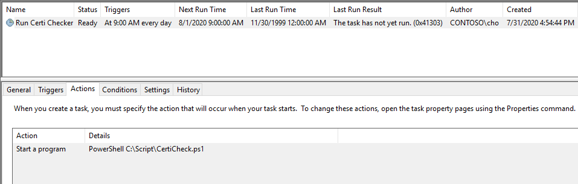
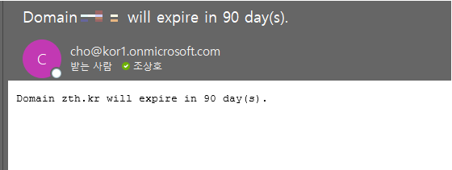

# Certificate checker

Description
==============
This script checks expiration date for IIS certificate and send notification if it will expire in 10 days.   
I got free 90 days certificate from "https://www.zerossl.com", (It's not an AD!) and I'm not sure if it has any notification for expiration.      
   
Get certificate information in PowerShell   

   
   
Add new task on Task Scheduler, running PowerShell script every 09:00 AM !!   

   
  
Sample meesage   

